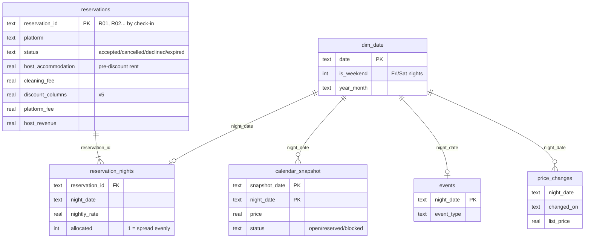

# Why October stalled: STR revenue analytics

An end-to-end analytics project built on real data from a short-term rental I operate: a 4 bed / 4 bath townhouse near the University of Florida in Gainesville, listed on Airbnb and Vrbo and managed in Hospitable.

**API extraction → SQLite data model → 13 SQL analyses → Streamlit dashboard**, with reconciliation checks, tests and anonymized exports.

**Live dashboard:** _link coming after Streamlit Community Cloud deploy_ · **Results:** [`results/RESULTS.md`](results/RESULTS.md)

---

## The business question

The unit launched in August 2026. September looked great (77% occupancy, driven by one 31-night stay), then October and November collapsed. Rent is $2,350/month and every turnover costs $180 to clean.

> **Why did October and November stall, and where is the revenue recoverable?**

## Findings (data snapshot Oct 8 2026, launch to Dec 31)

| | Finding | Evidence |
|---|---|---|
| 1 | **Demand fell off a cliff after September.** Occupancy went from 76.7% in September to 19.4% in October and 6.7% in November. Overall: 51 of 139 nights booked (36.7%), ADR $284.14, net revenue $8,786.61. | Q01, Q02 |
| 2 | **Weeknights are the hole, not weekends.** Sun–Thu nights sold 31.0% vs 51.3% for Fri/Sat, and weeknights that did sell went for $136 vs $514. | Q03 |
| 3 | **Price level isn't the main problem; pricing *strategy* was.** At the latest comp pull our totals sit −16% to +7% of the market median. But key nights swung hard: Sat Nov 14 went $537 → $600 → $205 → $180, and away-game weekends now sit 37% *below* an ordinary weekend while home games are 227% above. | Q08, Q09, Q10 |
| 4 | **Vrbo lost on availability, not price.** Vrbo converted 1 of 6 requests. All 5 lost requests were for nights already sold on Airbnb weeks earlier, which points to Vrbo availability not being blocked for sold nights. | Q06, Q13 |
| 5 | **Discounts and long stays dilute yield.** Discounts gave away 22.5% of gross rent ($4,103 of $18,206; length-of-stay 9.7%, top-rated 8.4%, promo 3.5%, early booking 0.9%). After the $180 clean, the 31-night stay earned $102/night vs $597/night for 1–2 night stays. | Q05, Q07 |
| 6 | **The recoverable revenue is specific.** The biggest unsold run is Nov 8–Dec 22: 45 nights worth $7,885 at current asks. October is only 2 nights short of covering rent at the current ask; November needs 8 more nights, December 12. | Q11, Q12 |

### Actions
- **Already taken** (from the price-change log, [`data/seed/price_changes.csv`](data/seed/price_changes.csv)): rebuilt pricing in Hospitable after an overwrite (Sep 29), audited prices against the comp median (Oct 4), moved open October nights to "fill mode" (Oct 8), and held the Vanderbilt premier home game at $650.
- **Recommended by this analysis:**
  1. Fix calendar sync, or tighten Vrbo availability, so sold Airbnb nights never show as open on Vrbo (finding 4).
  2. Price Sun–Thu separately: weekday-specific minimums and gap-night discounts instead of whole-stay discounts (findings 2, 5).
  3. Cap the length-of-stay discount and price month-long stays above the cleaning-adjusted break-even (finding 5).
  4. Stop repricing event nights week to week. Set event premiums once from the comp median and hold them (finding 3).

## Data sources and grain

| Source | How it's loaded | Table | Grain (one row = …) |
|---|---|---|---|
| Hospitable API `/v2/reservations?include=financials,properties` | `src/extract.py` (GET only) | `reservations` | one booking request, any status |
| Same, `financials.host.accommodation_breakdown` | `src/transform.py` | `reservation_nights` | one booked night of an accepted stay |
| Hospitable API `/v2/properties/{id}/calendar` | `src/extract.py` | `calendar_snapshot` | one night as seen in one daily pull |
| `data/seed/price_changes.csv` | seed | `price_changes` | one manual list-price change |
| `data/seed/comps.csv` | seed | `comps` | one comp-set pull for one stay |
| `data/seed/events.csv` | seed | `events` | one event night |
| `data/seed/cost_assumptions.csv` | seed | `cost_assumptions` | one cost input (rent, cleaner) |
| generated | `src/transform.py` | `dim_date` | one calendar date, Aug 15 2026–Jun 30 2027 |
| generated | `src/transform.py` | `data_quality_log` | one cleaning decision |
| view | `sql/schema.sql` | `fact_nightly` | one date on the spine, with its booking, price, event and status |

## Data model



`fact_nightly` is a view: `dim_date` LEFT JOIN booked nights, reservations, the latest calendar snapshot and events. Every date appears exactly once, with `night_status` = booked / open_for_sale / vacant_past / blocked / not_in_snapshot.

## Cleaning decisions

Every decision is written to `data_quality_log` when the database is built. In the Oct 8 build:

| Issue | Decision |
|---|---|
| Money arrives in integer cents | Converted to dollars once, in `transform.py` |
| One stay had 6 nightly rows for 4 nights (split rates on 2 dates) | Summed per date; the total still matches the stay's rent to the cent |
| The Vrbo stay has no per-night breakdown | Rent spread evenly to the cent, flagged `allocated = 1` |
| The API calls declined requests `denied` | Relabelled `declined` |
| Pass-through lodging tax inside the host payout (3 lost Vrbo requests) | Stored in `host_taxes`, excluded from net revenue |
| Hospitable's own fee on some Vrbo requests | Stored in `pms_fee`, separate from the channel fee |
| Cancelled stay | Row kept; excluded from nights and revenue |
| Guest PII | Never leaves `data/raw/` (gitignored); surrogate ids R01… ordered by check-in |

**Reconciliation checks** run on every build, and the build fails if any of them fails:
- nightly prices sum to rent, to the cent;
- every stay has exactly `nights` night rows;
- only accepted stays have nights;
- no night is double booked;
- the calendar's reserved nights equal the booked nights;
- the view has one row per date.

The transform also refuses to build if any payout can't be rebuilt from its parts (rent + cleaning − discounts − fees + tax) to the cent.

## Query index

| # | File | Question | SQL technique |
|---|---|---|---|
| 01 | [`01_headline_kpis.sql`](sql/analysis/01_headline_kpis.sql) | Occupancy, ADR, net revenue, RevPAR, launch to Dec 31 | Conditional aggregation on a date spine |
| 02 | [`02_monthly_performance.sql`](sql/analysis/02_monthly_performance.sql) | Month-by-month performance vs rent | GROUP BY, scalar subquery |
| 03 | [`03_weekend_vs_weekday.sql`](sql/analysis/03_weekend_vs_weekday.sql) | Fri/Sat vs Sun–Thu | CASE grouping, conditional AVG |
| 04 | [`04_lead_time.sql`](sql/analysis/04_lead_time.sql) | How far ahead guests book | Buckets + median via `ROW_NUMBER()` / `COUNT() OVER ()` |
| 05 | [`05_discount_leakage.sql`](sql/analysis/05_discount_leakage.sql) | Discounts as % of gross rent | `UNION ALL` unpivot, CTEs |
| 06 | [`06_channel_comparison.sql`](sql/analysis/06_channel_comparison.sql) | Airbnb vs Vrbo conversion, fees, yield | Conditional aggregation |
| 07 | [`07_stay_economics.sql`](sql/analysis/07_stay_economics.sql) | Contribution per night by stay length | CTE + CROSS JOIN to cost inputs |
| 08 | [`08_event_premium.sql`](sql/analysis/08_event_premium.sql) | Event vs ordinary night price, same day type | Baseline CTE joined back |
| 09 | [`09_price_vs_market.sql`](sql/analysis/09_price_vs_market.sql) | Our price vs comp median | `ROW_NUMBER() OVER (PARTITION BY …)` latest flag |
| 10 | [`10_price_change_history.sql`](sql/analysis/10_price_change_history.sql) | How list prices moved | `LAG()` over a named `WINDOW` |
| 11 | [`11_unsold_gaps.sql`](sql/analysis/11_unsold_gaps.sql) | Runs of unsold nights and their value | Gaps and islands (date − `ROW_NUMBER()`) |
| 12 | [`12_rent_coverage.sql`](sql/analysis/12_rent_coverage.sql) | Nights needed to cover rent each month | CTEs, ceiling division, feasibility flag |
| 13 | [`13_lost_requests.sql`](sql/analysis/13_lost_requests.sql) | Did lost requests overlap sold dates? | Self-join with interval overlap |

Each file starts with the question, its assumptions, and notes on where Postgres syntax would differ.

## Limitations

- **One property and about 9 stays.** This is descriptive analysis, not statistics. No forecasting or significance claims.
- **Comps are list prices** pulled manually from the market, not achieved rates.
- **Net revenue is spread evenly across a stay's nights**, so monthly figures for a stay that crosses months are approximate.
- **August is a partial month** (17 nights) but is compared with a full month's rent.
- **Surrogate ids (R01…) are ordered by check-in**, so they shift if a new booking lands earlier than existing ones.
- **Booking-pace analysis needs history.** The pipeline stores a calendar snapshot every run (see [`docs/SCHEDULE.md`](docs/SCHEDULE.md)), but only a few days exist so far.

## Reproduce it

```bash
git clone https://github.com/kaizencorphousing/str-revenue-analytics.git
cd str-revenue-analytics
py -m venv .venv
.venv\Scripts\activate        # macOS/Linux: source .venv/bin/activate
pip install -r requirements.txt
pytest -q                     # 44 tests on a synthetic fixture; no private data needed
streamlit run app/dashboard.py   # runs from the committed, anonymized data/processed/ CSVs
```

To rebuild from the API (owner only): copy `.env.example` to `.env`, add a Hospitable personal access token, then run `python run_all.py`. Later rebuilds can use `python run_all.py --offline`, which reuses the raw snapshots in `data/raw/`. Those snapshots are gitignored because they contain guest data.

## Project layout

```
app/dashboard.py        Streamlit + Plotly dashboard (reads data/processed only)
data/seed/              comps, price changes, events, costs (inputs the API can't provide)
data/processed/         anonymized CSV exports (committed)
data/raw/               raw API JSON (gitignored)
sql/schema.sql          tables + fact_nightly view
sql/analysis/           13 analysis queries
src/extract.py          Hospitable API -> data/raw (GET only, paginated, backoff)
src/transform.py        cleaning, cents -> dollars, data-quality log
src/load.py             builds gainesville.db, runs reconciliation checks
src/run_queries.py      results/*.csv + results/RESULTS.md
src/export.py           data/processed/*.csv for the dashboard
run_all.py              the whole pipeline (--offline to skip the API)
tests/                  pytest: extract, transform, pipeline fixture, PII checks
docs/                   spec, progress log, learning notes, Tableau guide, schedule
```

Built with Python 3.11, requests, pandas, SQLite, Streamlit and Plotly.
